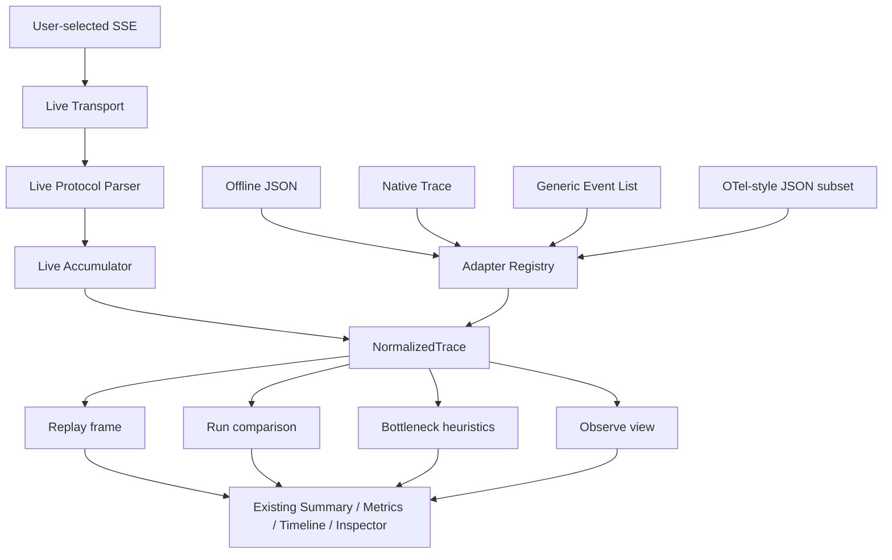

# Agent Trace Viewer Architecture

## Product boundary

Agent Trace Viewer is a browser-only local tool. Offline JSON is parsed in memory; Live mode opens only the user-selected SSE endpoint. No production backend, database, trace upload, analytics, telemetry, or persistence layer exists. The E2E SSE server is a test fixture.

## Data flow

## Boundaries

- `src/trace/adapters`: recognizes supported raw JSON shapes, validates/converts them through the existing trace parser, and applies deterministic adapter priority. Input is data and is never executed.
- `src/trace/live`: isolates EventSource transport, SSE protocol validation, run-ID binding, duplicate handling, and incremental normalized traces.
- `src/trace/replay`: pure functions map a normalized trace and virtual cursor to a replay state/frame. `requestAnimationFrame` is an application clock driver; the cursor is the source of visible state.
- `src/trace/compare`: computes B-minus-A duration, category, call, failure, and available token deltas. Components only format these values.
- `src/trace/analysis`: deterministic evidence observations and named thresholds; no provider or model call.
- `src/components` and `src/app`: keep UI selection, navigation, importer lifecycle, and event handlers. Existing TraceSummary, TraceMetrics, TraceTimeline, and EventInspector render normalized traces and replay frames.

## Concurrency and cleanup

Offline FileReader completions carry an import sequence. Starting another import, switching modes/views, or connecting Live increments the sequence; stale completions cannot change trace, selected inspector event, or active view. Live sessions use generation tokens to ignore callbacks from replaced connections. Replay's animation-frame subscription belongs to the Replay component effect and is canceled on pause, end, view change, or unmount.

## Comparison and analysis semantics

Compare selects only terminal normalized traces. Run duration uses the normalized run duration; stage totals reuse `calculateTraceMetrics`. Optional token deltas appear only when both runs have measurements. A zero duration baseline yields no percentage for a non-zero B duration.

The Bottleneck Lens uses only event durations that exist. It excludes missing values from shares and reports their presence separately. Dominant-stage and retrieval-heavy thresholds and repeated-tool count thresholds are constants beside the domain function.

## OTel-style subset

The adapter accepts top-level `spans[]` or `resourceSpans[].scopeSpans[].spans[]` JSON. It maps span IDs, names, trace IDs, parent IDs, scalar attributes, start/end timestamps, and error status to a flat normalized trace. One trace ID is accepted per import. This is a deliberately limited JSON mapping, not OTLP protocol or Collector support.
